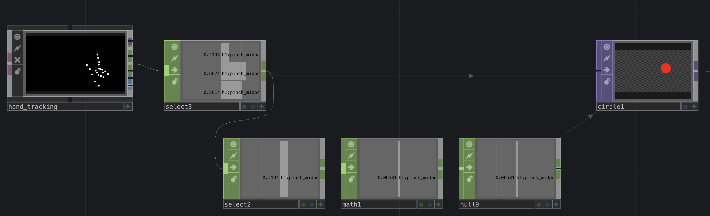
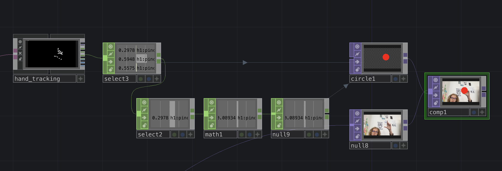

# MediaPipe sur Touchdesigner

*Ou comment utiliser MediaPipe dans TouchDesigner, récupérer les données et les utiliser pour interagir avec du visuel.*

- Le tuto [introduction à Touchdesigner](https://github.com/LucieMrc/IntroTD_FR)

## MediaPipe ???

[MediaPipe](https://developers.google.com/mediapipe) est un framework de machine-learning centré sur la computer vision.
Dans Touchdesigner, on peux l'utiliser notamment pour récuperer la position du squelette d'une personne devant une webcam, et créer des interactions avec.

La [documentation de MediaPipe pour TD](https://github.com/torinmb/mediapipe-touchdesigner?tab=readme-ov-file) sur github, avec la [vidéo de présentation](https://www.youtube.com/watch?v=Cx4Ellaj6kk&ab_channel=TorinBlankensmith).

Le [lien de téléchargement](https://github.com/torinmb/mediapipe-touchdesigner/releases) de la dernière version.

*Le fichier d'exemple MediaPipeTouchdesigner.toe.*

## Le fichier MediaPipeTouchdesigner.toe

### A. le node MediaPipe

Le node MediaPipe contient pleins de choses qui le font marcher, dans lesquels on ne rentrera pas en détails.

### B. les infos sur le temps réel

La première sortie du node MediaPipe est un CHOP qui permet de vérifier si on récupère bien les données en temps réel.

### C. le tracking du visage, des mains et du squelette

Le tracking du visage avec le node face_tracking permet de récupérer notamment la position du visage et de chacun de ses points, ainsi qu'un masque 3D du visage. On peux tracker jusqu'à 5 visages.

Le tracking des mains avec le node hand_tracking permet de récupérer la position des mains et de leurs points, ainsi qu'un rendu 3D.

*Les points de la main gauche et des doigts*

On récupère également la vélocité des mains, la distance entre les mains, et les données du geste de "pincer" dans le CHOP `helpers`, et 8 gestes pour chaque main dans le CHOP `gestures`.

Le tracking du squelette avec le node pose_tracking permet de récupérer les positions des différentes parties du corps, ainsi que la vélocité des poignets et la distance des mains. On peux tracker jusqu'à 5 personnes.

### D. la détection des objets et du visage

La détection et la classification des objets avec le node object_tracking1 sert à reconnaître les objets sur la vidéo avec plus ou moins de certitude. Ça ne marche pas hyper bien.

*Ici la détection de mon téléphone avec seulement 55% de certitude*

Le node face_detector1 sert à détecter des visages et sortir la positions de leurs points.

Le node image_classification essaie de reconnaître des objets sur l'image. Ça ne marche pas hyper bien.

### E. la Virtual Webcam Chain

Je ne suis pas vraiment sûre de l'usage de la Virtual Webcam Chain.

### F. le node image_segmentation

En cochant le paramètre `Image Segmentation` dans le node MediaPipe, le visuel de la webcam dans le node MediaPipe devient segmenté par couleur en fonction de la partie du corps (main, visage, cheveux) et du fond.

En sortie du node image_segmentation, on a alors une sortie par couleur qui nous donne la forme en blanc sur fond transparent, et la silhouette en couleur sur fond transparent si la Virtual Webcam Chain est activée.

Le mieux est de décocher `Show overlays` pour enlever toutes les détections sur l'image de la webcam et ne pas les avoir sur les images segmentées.

## Récupérer les données

 
On peux par exemple récupérer la position du "pinch" (le pincée entre le pouce et l'index), et l'écart mesuré. On crée un `select` TOP sur la sortie "helpers" (la 4ème), et on sélectionne " h1:pinch_midpoint:distance" (l'écart entre les doigts), "h1:pinch_midpoint:x" et "h1:pinch_midpoint:y" (la position x et y du milieu de l'écart entre les doigts).

la valeur 0,0 sur une image sur touch c'est le milieu de l'image, sur mediapipe 0,0 c'est en bas à gauche.

recalculer les données y en 3d : faire un select avec "*:y" ( * = tout, $:y = tout ce qui finit par y )# MediaPipe_TD
